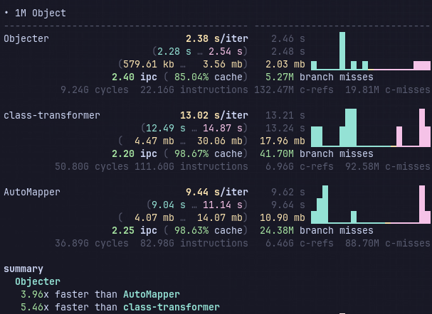

# Objecter

**A lightweight, decorator-free object mapping library for TypeScript.**

Influenced by [MapStruct](https://mapstruct.org/) (Java), Objecter provides a functional, type-safe way to convert objects between different shapes (e.g., Entity to DTO) without polluting your classes with decorators.

## Status

- **Version**: 1.2.0
- **Package**: `@mevaspace/objecter`
- **License**: MIT

## Why Objecter?

- **Zero Decorators**: Keep your domain entities clean. No `@Expose` or `@Map` on your business objects.
- **Type Safety**: Built with TypeScript in mind — paths, fields, and options are type-checked.
- **Functional Composition**: Plain functions for transforms and validations — no magic.
- **Flexible**: Explicit mappings where you need them, auto-mapping where you don't.
- **Zero Runtime Dependencies**: Lightweight and focused.
- **Faster than Popular Packages**: See benchmarks below.

## Benchmarks



Objecter significantly outperforms other popular object mapping libraries across all dataset sizes, even with circular dependency checks enabled. Benchmarks were conducted using [mitata](https://github.com/evanwashere/mitata) on Node.js 24.10.0 with an AMD Ryzen 5 5500U processor.

### Performance Comparison

| Dataset Size  | Objecter      | AutoMapper               | class-transformer        |
| :------------ | :------------ | :----------------------- | :----------------------- |
| Single Object | **66.98 µs**  | 166.94 µs (2.49x slower) | 205.38 µs (3.07x slower) |
| 1K Objects    | **155.32 ms** | 306.08 ms (1.97x slower) | 295.32 ms (1.90x slower) |
| 10K Objects   | **312.33 ms** | 416.68 ms (1.33x slower) | 454.23 ms (1.45x slower) |
| 100K Objects  | **501.98 ms** | 1.36 s (2.70x slower)    | 1.65 s (3.29x slower)    |
| 1M Objects    | **2.38 s**    | 9.44 s (3.96x slower)    | 13.02 s (5.46x slower)   |

- **Up to 5.46x faster** than class-transformer on large datasets
- **Up to 3.96x faster** than AutoMapper on large datasets
- **Circular dependency checking** included with minimal performance impact

### Technical Metrics (1M objects, circular check enabled)

| Library           | IPC  | Instructions | Cache Hit |
| :---------------- | :--- | :----------- | :-------- |
| Objecter          | 2.40 | 22.16B       | 85.04%    |
| AutoMapper        | 2.25 | 82.98B       | 98.63%    |
| class-transformer | 2.20 | 111.60B      | 98.67%    |

Objecter achieves superior performance through dramatically fewer total instructions (80% reduction vs class-transformer) and optimized CPU utilization.

_Benchmark configuration: AMD Ryzen 5 5500U @ 1.40 GHz, Node.js 24.10.0, Ubuntu Linux_

```bash
pnpm test:benchmark
```

---

## Installation

> **Note**: Currently only available via GitHub Release Assets.

```bash
# npm
npm install https://github.com/mevaspace/objecter/releases/download/v<version>/objecter.tar.gz

# pnpm
pnpm add https://github.com/mevaspace/objecter/releases/download/v<version>/objecter.tar.gz

# yarn
yarn add https://github.com/mevaspace/objecter/releases/download/v<version>/objecter.tar.gz
```

---

## Usage

### 1. Basic Conversion

```typescript
import { Objecter } from '@mevaspace/objecter';

class UserEntity {
  id: number;
  firstName: string;
  lastName: string;
  email: string;
}

class UserDTO {
  id: number;
  fullName: string;
  email: string;
}

const user = new UserEntity();
user.id = 1;
user.firstName = 'John';
user.lastName = 'Doe';
user.email = 'john@example.com';

const userDto = Objecter.convert(user, UserDTO, [
  { from: 'id' },
  { from: 'email' },
  { from: 'firstName', to: 'fullName', transform: (_, source: UserEntity) => `${source.firstName} ${source.lastName}` },
]);
// UserDTO { id: 1, email: 'john@example.com', fullName: 'John Doe' }
```

### 2. Validation and Transformation

The `validate` property accepts three forms:

- **Predicate** `(value) => boolean`
- **ValidateFn** `(value, fieldName, context) => { valid: boolean, errors?: string[] }`
- **Zod schema** — any object with a `safeParse` method

```typescript
import { Objecter, Validators, Transformers } from '@mevaspace/objecter';
import { z } from 'zod'; // optional

const mapping = [
  { from: 'email', transform: Transformers.trim(), validate: Validators.pattern(/^.+@.+\..+$/) },
  { from: 'age', transform: Transformers.toNumber(), validate: (age: number) => age >= 18 && age <= 100 },
  { from: 'username', validate: z.string().min(3).max(20) },
];
```

### 3. Nested Objects

```typescript
import { Objecter } from '@mevaspace/objecter';

class AddressDTO {
  streetAddress: string;
  cityName: string;
}

class UserDTO {
  id: number;
  location: AddressDTO;
}

const addressMapper = Objecter.createMapper(AddressDTO, [
  { from: 'street', to: 'streetAddress' },
  { from: 'city', to: 'cityName' },
]);

const userDto = Objecter.convert(userEntity, UserDTO, [
  { from: 'id' },
  { from: 'address', to: 'location', transform: addressMapper },
]);
```

### 4. Reusable Mappers

```typescript
// Create once, use everywhere
const userMapper = Objecter.createMapper(UserDTO, mapping);
const dto1 = userMapper(user1);
const dto2 = userMapper(user2);

// Array mapper
const userListMapper = Objecter.createArrayMapper(UserDTO, mapping);
const dtoList = userListMapper(users);
```

### 5. Auto Mapping

Enable `autoMap` to automatically copy properties with matching names that aren't explicitly mapped.

```typescript
const dto = Objecter.convert(
  entity,
  Dto,
  [{ from: 'db_id', to: 'id' }], // only fields that differ
  { autoMap: true },
);
```

### 6. Conditional Mapping with Predicates

Use `skipIf` to conditionally skip field mapping based on any custom logic.

```typescript
import { Objecter } from '@mevaspace/objecter';

const mapping = [
  { from: 'name' },
  { from: 'email', skipIf: (_value, source: any) => source.role === 'admin' },
  { from: 'internalNotes', skipIf: (_value, _source, context) => context.data?.publicView === true },
];

const dto = Objecter.convert(user, UserDTO, mapping, { context: { publicView: true } });
```

Use `skipIfNull` as shorthand to skip when the source value is `null` or `undefined`:

```typescript
{ from: 'nickname', skipIfNull: true }
```

### 7. Schema-Level Validation

Validate the entire target object after all field mappings are applied. Useful for rules that span multiple fields.

```typescript
import { Objecter } from '@mevaspace/objecter';

const dto = Objecter.convert(source, RegistrationDTO, mapping, {
  validateSchema: (target: any) => {
    const errors: string[] = [];
    if (target.password !== target.confirmPassword) errors.push('Passwords do not match');
    if (target.age < 18) errors.push('Must be at least 18 years old');
    return errors.length ? { valid: false, errors } : { valid: true };
  },
});
```

### 8. Merging Objects

Merge multiple source objects into one target. Later sources override earlier ones.

```typescript
const merged = Objecter.merge([source1, source2], TargetDTO, mapping);
```

### 9. Plain Objects

Strip the class prototype and return a plain object.

```typescript
const plain = Objecter.toPlainObject(userEntity, mapping);
```

### 10. Mapping to Interfaces

Use `asTarget<T>()` to map to an interface without defining a concrete class.

```typescript
import { Objecter, asTarget } from '@mevaspace/objecter';

interface IUserTarget {
  fullName: string;
  age: number;
}

const result = Objecter.convert(source, asTarget<IUserTarget>(), [
  { from: 'firstName', to: 'fullName' },
  { from: 'birthYear', to: 'age' },
]);
// Returns a plain object typed as IUserTarget
```

### 11. Global Configuration

```typescript
import { Objecter } from '@mevaspace/objecter';

Objecter.configure({ autoMap: true, throwOnValidationError: false });

const dto1 = Objecter.convert(source1, TargetDTO, mapping);
const dto2 = Objecter.convert(source2, TargetDTO, mapping);

// Per-call options override global config
const dto3 = Objecter.convert(source3, TargetDTO, mapping, { autoMap: false });

Objecter.resetConfig(); // back to library defaults
```

### 12. Mapping Profiles

Register named, reusable mapping definitions validated at registration time.

```typescript
import { Objecter, type MappingProfile } from '@mevaspace/objecter';

const userProfile = Objecter.registerProfile({
  name: 'UserToDto',
  targetClass: UserDTO,
  mapping: [{ from: 'id' }, { from: 'name' }],
  options: { autoMap: true },
});

const dto = Objecter.map<UserDTO>(user, 'UserToDto');

// Override profile options per-call
const dto2 = Objecter.map<UserDTO>(user, 'UserToDto', { autoMap: false });

Objecter.clearProfiles();
```

> If the profile name is not found, `Objecter.map()` throws a `MappingError`.

### 13. Async Transforms

Use async methods when any transform needs to perform async operations (API calls, DB lookups).

```typescript
import { Objecter, type FieldMapping } from '@mevaspace/objecter';

const fetchRole = async (userId: number): Promise<string> => {
  const res = await fetch(`/api/roles/${userId}`);
  return (await res.json()).role;
};

const mapping: FieldMapping[] = [{ from: 'id' }, { from: 'name' }, { from: 'id', to: 'role', transform: fetchRole }];

const user = await Objecter.convertAsync(source, UserWithRole, mapping);
const users = await Objecter.convertArrayAsync(sources, UserWithRole, mapping);

// Profile-based
Objecter.registerProfile({ name: 'UserWithRole', targetClass: UserWithRole, mapping });
const result = await Objecter.mapAsync<UserWithRole>(source, 'UserWithRole');
```

> Async methods handle both sync and async transforms. Use them when at least one transform returns a `Promise`.

### 14. Excluding Fields

#### `FieldMapping.exclude` — skip an explicit mapping

Set `exclude: true` on a field mapping to skip it entirely at runtime. Useful for suppressing a field from a shared base mapping.

```typescript
const mapping = [
  { from: 'id' },
  { from: 'name' },
  { from: 'password', exclude: true }, // never copied
];
```

#### `excludeFields` — exclude named fields from `autoMap`

```typescript
const dto = Objecter.convert(source, UserDTO, [], {
  autoMap: true,
  excludeFields: ['password', 'deletedAt'], // type-safe when TSource is inferred
});
```

When `TSource` is known (via a typed `source` argument), `excludeFields` is checked against valid source keys at compile time.

#### `excludePattern` — exclude fields matching a pattern from `autoMap`

```typescript
// Exclude fields starting with '_'
Objecter.convert(source, UserDTO, [], { autoMap: true, excludePattern: /^_/ });

// String form is converted to RegExp
Objecter.convert(source, UserDTO, [], { autoMap: true, excludePattern: '^internal' });
```

#### Combining both

`excludeFields` and `excludePattern` are applied together — a field is excluded if it matches either.

```typescript
Objecter.convert(source, UserDTO, [], { autoMap: true, excludeFields: ['email'], excludePattern: /^_/ });
```

### 15. Async Validation

```typescript
const mapping = [
  {
    from: 'username',
    validateAsync: async (username: string) => {
      const taken = await db.checkUsername(username);
      return taken ? { valid: false, errors: ['Username taken'] } : { valid: true };
    },
  },
];

const dto = await Objecter.convertAsync(source, UserDto, mapping, {
  validateSchemaAsync: async (target: any) => {
    const blacklisted = await db.checkBlacklist(target.email);
    return blacklisted ? { valid: false, errors: ['Email blacklisted'] } : { valid: true };
  },
});
```

> `validateAsync` and `validateSchemaAsync` are **only** executed by async methods. Sync methods ignore them.

---

## API Reference

### Core Methods

| Method                                                                    | Description                              |
| :------------------------------------------------------------------------ | :--------------------------------------- |
| `Objecter.convert(source, TargetClass, mapping, options?)`                | Convert a single object                  |
| `Objecter.convertAsync(source, TargetClass, mapping, options?)`           | Async version — handles async transforms |
| `Objecter.convertArray(sources, TargetClass, mapping, options?)`          | Convert an array                         |
| `Objecter.convertArrayAsync(sources, TargetClass, mapping, options?)`     | Async array conversion                   |
| `Objecter.convertArrayGenerator(sources, TargetClass, mapping, options?)` | Lazy generator for large arrays          |
| `Objecter.createMapper(TargetClass, mapping, options?)`                   | Returns a reusable single-object mapper  |
| `Objecter.createArrayMapper(TargetClass, mapping, options?)`              | Returns a reusable array mapper          |
| `Objecter.merge(sources, TargetClass, mapping, options?)`                 | Merge multiple sources into one target   |
| `Objecter.toPlainObject(source, mapping?)`                                | Strip prototype, return plain object     |
| `Objecter.configure(options)`                                             | Set global defaults                      |
| `Objecter.resetConfig()`                                                  | Reset to library defaults                |
| `Objecter.registerProfile(profile)`                                       | Register a named mapping profile         |
| `Objecter.map(source, profileName, options?)`                             | Convert using a registered profile       |
| `Objecter.mapAsync(source, profileName, options?)`                        | Async profile-based mapping              |
| `Objecter.clearProfiles()`                                                | Remove all registered profiles           |
| `asTarget<T>()`                                                           | Use an interface as mapping target       |

### Mapping Options

| Option                   | Type                                                 | Default | Description                                                |
| :----------------------- | :--------------------------------------------------- | :------ | :--------------------------------------------------------- |
| `throwOnValidationError` | `boolean`                                            | `true`  | Throw when field or schema validation fails                |
| `throwOnMissingFields`   | `boolean`                                            | `true`  | Throw when a required source field is missing              |
| `copyUndefined`          | `boolean`                                            | `false` | Copy fields whose source value is `undefined`              |
| `strictMapping`          | `boolean`                                            | `true`  | Throw when a mapping targets a non-existent property       |
| `autoMap`                | `boolean`                                            | `false` | Auto-copy matching property names not explicitly mapped    |
| `checkCircular`          | `boolean`                                            | `true`  | Guard against circular references during deep clone        |
| `context`                | `Record<string, unknown>`                            | `{}`    | Extra data passed to transforms and validators             |
| `validateSchema`         | `(target, source, ctx) => ValidationResult`          | —       | Schema-level validation after all mappings                 |
| `validateSchemaAsync`    | `(target, source, ctx) => Promise<ValidationResult>` | —       | Async schema validation (async methods only)               |
| `excludeFields`          | `string[]`                                           | `[]`    | Field names to exclude from `autoMap`                      |
| `excludePattern`         | `string \| RegExp`                                   | —       | Pattern — matching field names are excluded from `autoMap` |

### FieldMapping Options

| Option          | Type                                 | Description                                                 |
| :-------------- | :----------------------------------- | :---------------------------------------------------------- |
| `from`          | `string`                             | Source property path (supports `'user.address.city'`)       |
| `to`            | `string`                             | Target property path (defaults to `from`)                   |
| `transform`     | `TransformFn`                        | Value transformer — may return a `Promise` in async methods |
| `defaultValue`  | `unknown`                            | Fallback when source value is `null` or `undefined`         |
| `optional`      | `boolean`                            | Skip missing field instead of throwing                      |
| `validate`      | `Validator \| Validator[]`           | Sync validator(s)                                           |
| `validateAsync` | `AsyncValidator \| AsyncValidator[]` | Async validator(s) — async methods only                     |
| `skipIfNull`    | `boolean`                            | Skip field when value is `null` or `undefined`              |
| `skipIf`        | `(value, source, ctx) => boolean`    | Predicate — skip field when it returns `true`               |
| `exclude`       | `boolean`                            | Skip this mapping entirely                                  |

---

## Built-in Validators

Accessible via `Validators` named export:

| Validator                             | Description                             |
| :------------------------------------ | :-------------------------------------- |
| `Validators.required()`               | Value must not be `null` or `undefined` |
| `Validators.pattern(regex, message?)` | Must match regex pattern                |
| `Validators.oneOf(values)`            | Must be one of the allowed values       |
| `Validators.nonEmptyArray()`          | Array must have at least one element    |
| `Validators.custom(fn, message)`      | Custom validation function              |

## Built-in Transformers

Accessible via `Transformers` named export:

| Transformer                       | Description                                  |
| :-------------------------------- | :------------------------------------------- |
| `trim()`                          | Trim whitespace from string                  |
| `toUpperCase()` / `toLowerCase()` | Change string case                           |
| `toNumber()`                      | Convert to number                            |
| `toBoolean()`                     | Convert to boolean                           |
| `toString()`                      | Convert to string                            |
| `toDate()`                        | Convert to `Date`                            |
| `toISOString()`                   | Format to ISO string                         |
| `parseJSON()`                     | Parse JSON string                            |
| `toJSON()`                        | Stringify to JSON                            |
| `round(decimals?)`                | Round number                                 |
| `clamp(min, max)`                 | Clamp number within range                    |
| `defaultTo(value)`                | Use default when value is `null`/`undefined` |
| `mapValue(map, fallback?)`        | Map value via a dictionary                   |
| `pipe(...fns)`                    | Chain multiple transformers                  |
| `when(condition, transform)`      | Apply transform conditionally                |
| `pick(path)`                      | Extract nested value from object             |
| `split(delimiter)`                | Split string into array                      |
| `join(delimiter)`                 | Join array into string                       |

---

## Custom Validators and Transformers

### Validators

```typescript
import { type ValidateFn } from '@mevaspace/objecter';

// Simple predicate
const isAdult = (value: unknown): boolean => typeof value === 'number' && value >= 18;

// Detailed result with custom errors
const validatePassword: ValidateFn = (value, fieldName) => {
  if (typeof value !== 'string') return { valid: false, errors: [`${fieldName} must be a string`] };

  const errors: string[] = [];
  if (value.length < 8) errors.push('Minimum 8 characters');
  if (!/[A-Z]/.test(value)) errors.push('Requires uppercase letter');
  if (!/[0-9]/.test(value)) errors.push('Requires number');

  return errors.length ? { valid: false, errors } : { valid: true };
};

// Factory pattern for configurable validators
const minLength =
  (min: number) =>
  (value: unknown): boolean =>
    typeof value === 'string' && value.length >= min;
```

### Zod Integration

```typescript
import { z } from 'zod';

const mapping = [
  { from: 'email', validate: z.string().email() },
  { from: 'age', validate: z.number().min(18) },
  { from: 'username', validate: z.string().min(3).max(20) },
];
```

### Transformers

```typescript
import { type TransformFn } from '@mevaspace/objecter';

// Factory transformer
const truncate =
  (maxLength: number): TransformFn =>
  (value) => {
    if (typeof value !== 'string') return value;
    return value.length > maxLength ? `${value.slice(0, maxLength)}...` : value;
  };

// Context-aware transformer
const formatCurrency: TransformFn = (value, _source, context) => {
  const locale = context.data?.locale ?? 'en-US';
  const currency = context.data?.currency ?? 'USD';
  if (typeof value !== 'number') return value;
  return new Intl.NumberFormat(locale, { style: 'currency', currency }).format(value);
};

// Composing transformers
const mapping = [
  { from: 'email', transform: Transformers.pipe(Transformers.trim(), Transformers.toLowerCase()) },
  { from: 'bio', transform: truncate(200) },
  { from: 'price', transform: formatCurrency },
];

const dto = Objecter.convert(source, TargetDTO, mapping, { context: { locale: 'id-ID', currency: 'IDR' } });
```

---

## Limitations

1. **Zero-Argument Constructor**: Target class must have a no-arg constructor (or none defined). Objecter instantiates the target with `new TargetClass()`.
2. **Circular References**: Circular object graphs will throw `Circular reference detected during deep clone`. Disable with `checkCircular: false` only if you know no cycles exist.
3. **Prototype Safety**: `autoMap` iterates target instance and prototype properties. Keep target classes as simple DTOs.
